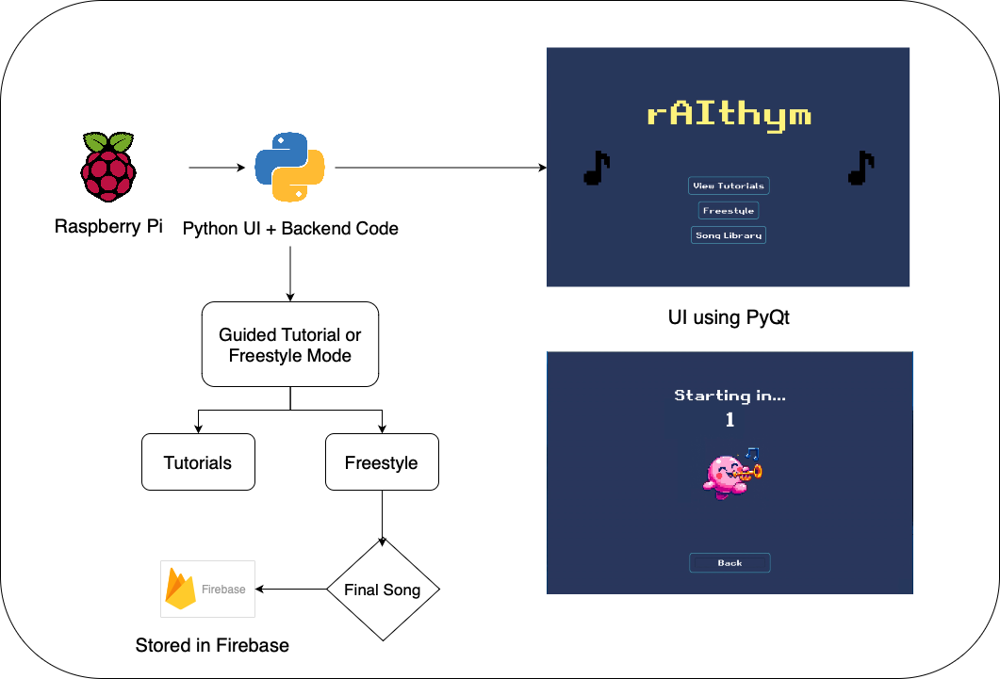
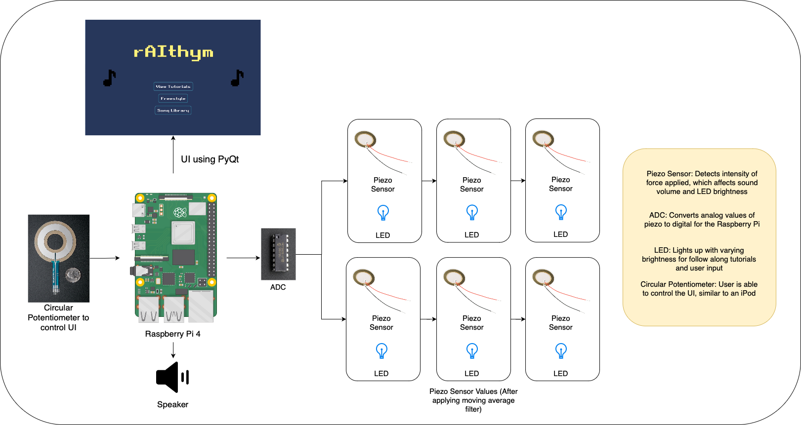
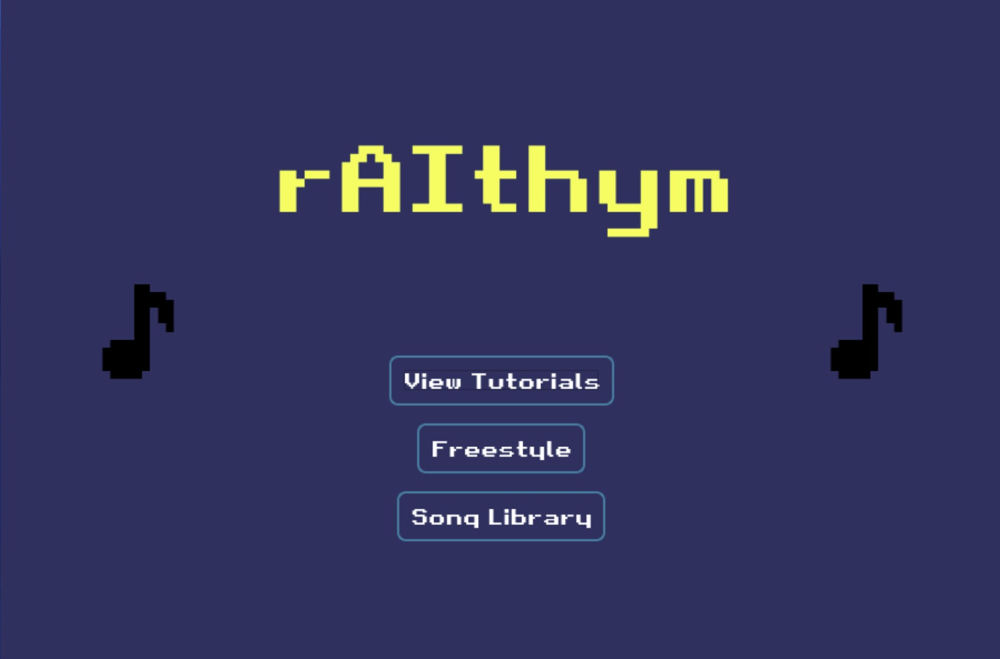

# Educational Music Composer

Team 8: Ashwin Nishad, Freya Yu, Gwen Zhang

## Solution
Our solution is a child-friendly MIDI controller with a simplistic user interface and machine learning mechanism that can teach children music composition in an interactive and sensory-stimulating way.

## Sensors
- 6x Piezo Sensors
- [Soft Circular Potentiometer](https://www.adafruit.com/product/1069)

## Software Architecture

## Hardware Architecture

## Images of the UI

